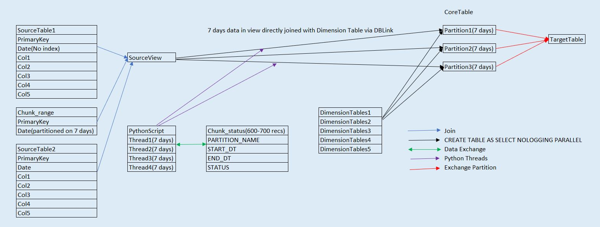

# STAR Format

## Situation

Decommissioning of old datawarehouse with a new datawarehouse, data model and a separate database instance. Datawarehouse ETL system consists of file upload on daily basis from different source systems. New datawarehouse has been set up in parallel or soft live and once data is signed off , all the data from existing datawarehouse will be migrated to new datawarehouse including transformations as per new data model.  
For this migration , we need to execute below steps:-

1. Extract terabytes of data with billion records from old database instance 

2) Apply transformation.

3) Resolve dimension keys.

4) Log Error if any. 

## Task

Below constraints/challenges we faced during this history load:-

1) Must be done during and within one weekend i.e. within 24-36 hours.

2) Non-availability of any big data technologies such as hadoop, multiple clusters etc. 

3) No ETL tools such as Informatica, Vertica available . 

4) Transport tablespace option in Oracle not available as data was distributed in multiple tablespaces. 

5) Temporary allocating terabytes of space to staging area to apply transformations.

6) Applying dblink resulted in ineffcient execution plans.

7) Queries failing sometimes due to lack of TEMP space when going with bigger chunk of data.

8) Tried to increase insert speed by disabling indexes but time taken to rebuild indexes will run for several hours. 

9) Huge number of joins both at old datawarehouse to convert into new data model and for resolving dimension keys.

10) We did a sample run of three months and it took approx 24 hours to do a complete load end-to-end. 

By above calculation , not only would we be not able to complete this during a weekend but this load would have run for several days as we had data from 2007 to 2019.

## Action

Traditional Approach

New Approach

Below were the steps we took to tackle above problems :-
1) Target tables in new datawarehouse were partitioned for 7 days. So rather than extracting all data into stage and then loading it into target tables we will be pulling data for only 7 days for one thread. 
2) Use of dblink was the quickest option as it didnot involve any other servers or staging area. However it was running inefficient execution plans . So we created a new table in old datawarehouse which was paritioned on date with interval range of 7 days and had primary keys for source tables. 
For example :-

Suppose structure of old table is 

Source_table

|Primary_key|Date|Col1|Col2|Col3

In old table we dont have any index on date column. So we create a new table which is partitioned on Date column. 

CREATE TABLE chunk_range AS
PARITION BY RANGE (Date) INTERVAL ('7','DAYSTOINTERVAL')
SELECT Primary_key , Date  from Source_Table ;

One time table creation took 13-14 mins. 

While pulling data we created a join between chunk_range and Source_table and it guaranteed a return of 7 days record and efficient execution plans. 

3) Use of CREATE TABLE AS SELECT NOLOGGING PARALLEL . This option doesnot generate any redo logs which provides a major performance enhancement . 

4) Because of Option 3) we dont have option for merging data. Here we use EXCHANGE_PARTITION feature provided by Oracle which doesnot need any additional space . 

5) To remove space used for staging area we created an sql query which applies all transformations and resolution of dimension keys 

6) Due to use of dblinks and using tables from both databases this imposes a risk that either all tables are pulled from old database to new one or vice versa which may increase chances of temp space shortage. 

7) Use of Python for multithreading which runs 3-4 threads at a time with each thread pulling data for 7 days. 

## Result

1) Reducing time from several days to 24 hours to load terabytes of data without using any big data frameworks.
2) Saving additional space required for staging area. 
3) Saving temp space usage used in Oracle. 
